# Top 17 No-Code Mobile App Builders Ranked in 2025 (Latest Compilation)

Building a mobile app used to mean hiring developers, spending months in development, and burning through budgets. Today, you can skip all that and turn your idea into a real iOS and Android app in hours—no coding knowledge required. Whether you run a WordPress blog, an online store, or just need a custom app for your business, these platforms let you build, test, and publish apps faster than ever.

This guide breaks down 17 proven no-code mobile app builders that handle everything from simple website conversions to complex native apps with custom features. You'll discover which tools work best for different scenarios, what makes each one stand out, and how quickly you can get your app live on the app stores.

---

## **[AppMySite](https://www.appmysite.com)**

Turn your website into a native mobile app in minutes—optimized for WordPress and WooCommerce.

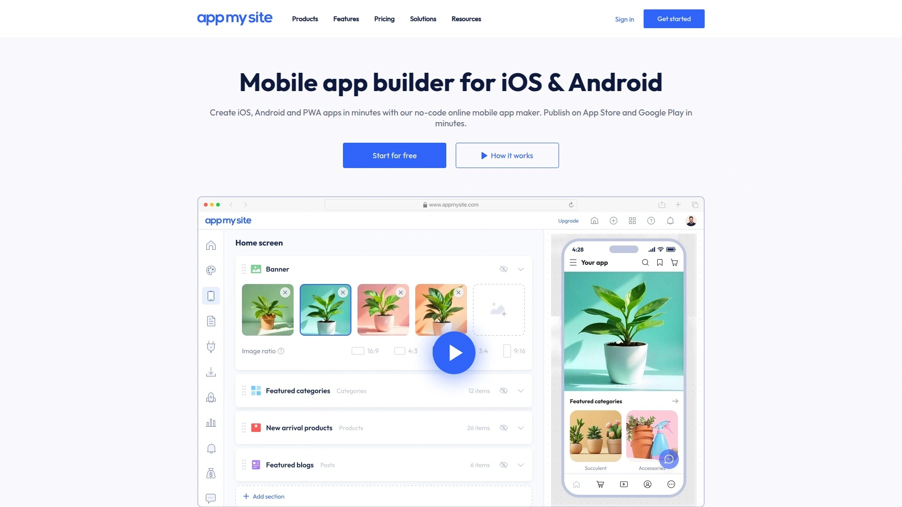

AppMySite specializes in converting websites into fully functional native iOS and Android apps without writing a single line of code. The platform shines brightest when working with WordPress and WooCommerce sites, offering real-time synchronization between your website and app. You can customize everything from splash screens to color schemes, manage categories, and configure web views directly through an intuitive dashboard.

What sets AppMySite apart is its comprehensive preview system—test your app on emulators or download a demo version to your actual device before committing. The platform includes connectivity troubleshooting features that identify sync issues between your site and app automatically. Once you're satisfied, premium subscribers can download ready-to-publish APK and IPA files for immediate app store submission.

The free plan lets you design, build, and test unlimited times. Premium plans unlock white-label branding, instant app delivery, and unlimited revisions—all changes reflect in your live app in real-time. AppMySite works particularly well for bloggers, eCommerce store owners, and digital publishers who want mobile apps that stay automatically updated with their websites.

***

## **[Appy Pie](https://www.appypie.com)**

Beginner-friendly platform with AI-powered website-to-app conversion for quick deployment.

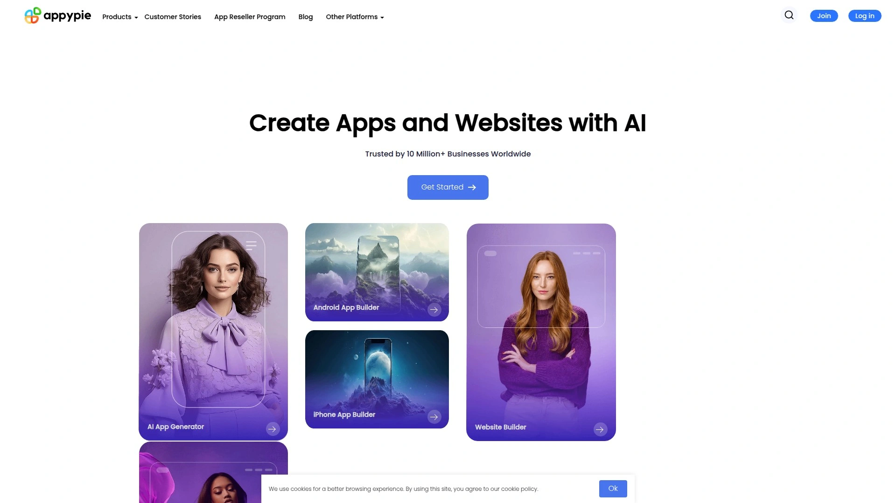

Appy Pie uses AI technology to convert websites into mobile apps for both Android and iOS platforms within minutes. The platform features a visual editor that requires zero coding experience, making it accessible for complete beginners and small business owners. You simply enter your URL, customize basic settings, and the platform handles the technical conversion process.

The no-code builder includes push notification support, offline access capabilities, and multiple monetization options built directly into the platform. Appy Pie provides store submission assistance to guide users through the Google Play and Apple App Store publishing requirements. The tool supports both dynamic and static websites, giving flexibility across different site architectures.

**Target users:** Small businesses, local stores, content creators, and bloggers who prioritize speed and simplicity over advanced customization. The platform works best when you need a straightforward app wrapper without complex native functionality.

***

## **[Twinr](https://twinr.dev)**

Premium white-label solution with native app behavior and Firebase integration.

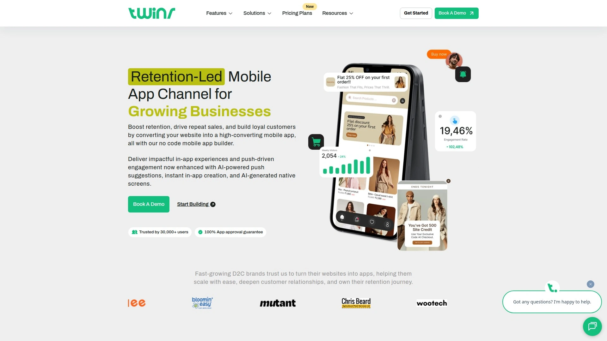

Twinr goes beyond simple website wrappers by delivering true native app experiences with extensive branding control. The platform integrates with Firebase for backend functionality, enabling features like user authentication, real-time databases, and cloud messaging. All content updates happen in real-time between your website and mobile app without manual intervention.

White-label options remove all Twinr branding, letting you present apps entirely under your own company identity. The platform supports both Android and iOS with optimized performance for each operating system. Twinr's native screens boost engagement by providing app-specific interfaces that feel faster and more responsive than web views.

This builder suits growing businesses and startups focused on delivering premium app experiences to their users. Development agencies often choose Twinr when clients demand professional-grade apps with complete brand customization.

***

## **[Median](https://median.co)**

Speed-focused converter that transforms mobile-responsive websites into native app wrappers.

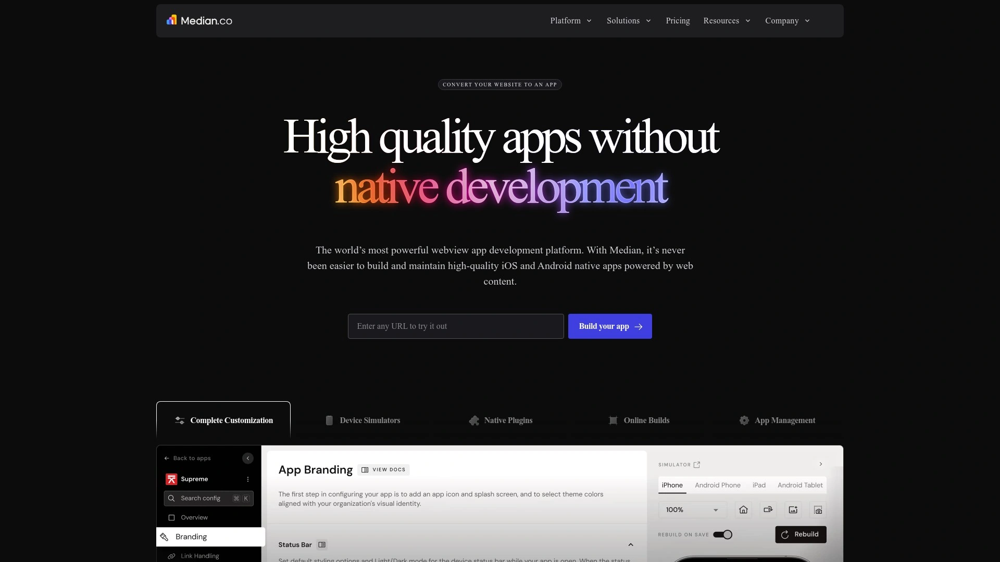

Median excels at rapid deployment for websites that already perform well on mobile browsers. The platform wraps your existing mobile site in a native app container, adding features like push notifications, analytics tracking, and offline caching. Setup takes minimal time since Median leverages your existing mobile-optimized design rather than rebuilding from scratch.

Built-in monitoring tools track app performance, user behavior, and technical errors in real-time. The offline caching system stores critical content locally on devices, ensuring your app remains functional without internet connectivity. Deployment to both iOS App Store and Google Play Store happens through a streamlined process with guided documentation.

**Best for:** SaaS platforms, community apps, and productivity tools where users already interact with a strong mobile website. Marketing teams appreciate Median's quick turnaround when launching campaigns that require rapid app deployment.

---

## **[MobiLoud](https://www.mobiloud.com)**

Managed service that converts high-traffic WordPress sites into native apps with comprehensive support.

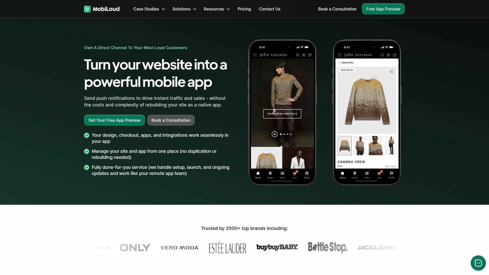

MobiLoud provides a done-for-you approach where their team handles building, testing, and publishing your WordPress mobile app. The service integrates seamlessly with your existing WordPress theme and plugins, including full WooCommerce support for online stores. Unlike DIY platforms, MobiLoud includes setup configuration, store submissions, ongoing maintenance, and priority technical support.

Apps maintain standard features like push notifications, offline content access, and Google Analytics integration—all completely white-labeled without any MobiLoud branding visible to users. The service starts with a one-time setup fee, followed by monthly subscriptions that include unlimited push notifications, maintenance updates, and Firebase integration. Plans scale based on active user counts, from startup tiers supporting 1,000 users to corporate options with dedicated account managers.

MobiLoud targets high-traffic WordPress websites, established blogs, news publications, and eCommerce stores that need professional app development without hiring an internal team. The 60-day money-back guarantee removes risk for businesses testing mobile app viability.

***

## **[Natively](https://www.buildnatively.com)**

Universal converter supporting Bubble, Webflow, Wix, Tilda, WordPress, and Shopify websites.

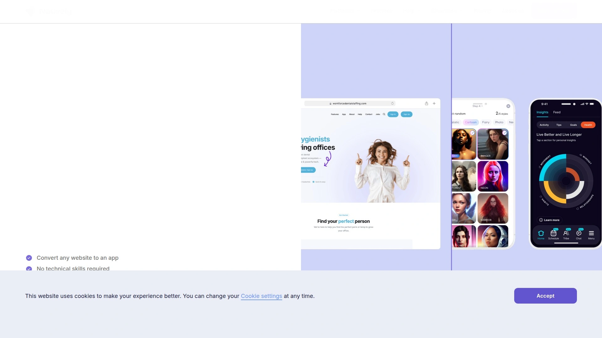

Natively works with virtually any website builder platform, making it uniquely versatile for users already invested in specific web technologies. The tool converts sites built on Bubble, Webflow, Wix, Tilda, WordPress, and Shopify into native iOS and Android apps without switching ecosystems. This cross-platform compatibility means you maintain your current workflow while expanding to mobile.

The free preview plan lets you test all features and build your app completely before paying anything—you only invest when ready to publish. Paid options include a startup plan for continuous updates, a lifetime deal with 10 rebuilds included, and full-service plans where Natively's team assists or fully manages development. Pricing starts significantly lower than competitors, with monthly subscriptions under $35 and lifetime options available.

Developers appreciate the unlimited rebuild capability in paid tiers, allowing constant iteration without additional charges. The platform handles publishing to both iOS App Store and Google Play Store as part of standard plans.

***

## **[BuildFire](https://buildfire.com)**

Industry-specific templates with AI-generated designs for custom app creation.

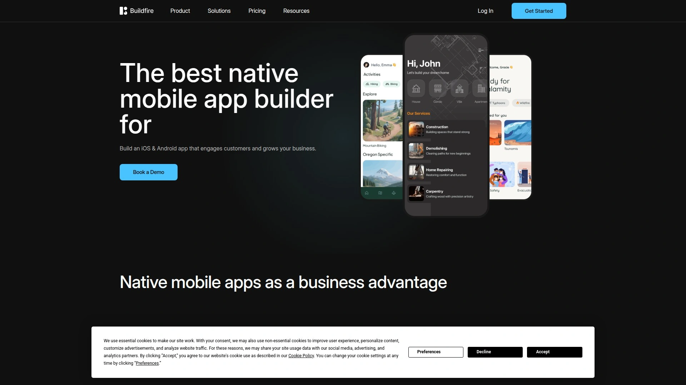

BuildFire combines no-code simplicity with custom development services under one roof. The platform offers over 150 pre-built plugins and templates designed for 22 specific industries including eCommerce, travel, fitness, and social media. An AI-powered tool generates custom templates based on your requirements—describe your app's purpose, and the AI suggests optimized layouts with requested features.

The drag-and-drop interface provides real-time previews as you build, showing exactly how your app looks on actual devices. Users can add features like live chat, push notifications, in-app purchases, and content management systems through simple plugin installation. A media library stores uploaded images for easy reuse across different app screens.

**SDK access** allows experienced developers to create custom functionality and integrate third-party APIs when standard features aren't enough. BuildFire handles both the DIY app builder platform and full custom development projects, accommodating everyone from solo entrepreneurs to enterprises. The 14-day free trial requires no credit card, letting you explore the entire platform risk-free.

***

## **[Appilix](https://appilix.com)**

Minimal platform for solopreneurs needing quick, budget-friendly Android app conversions.

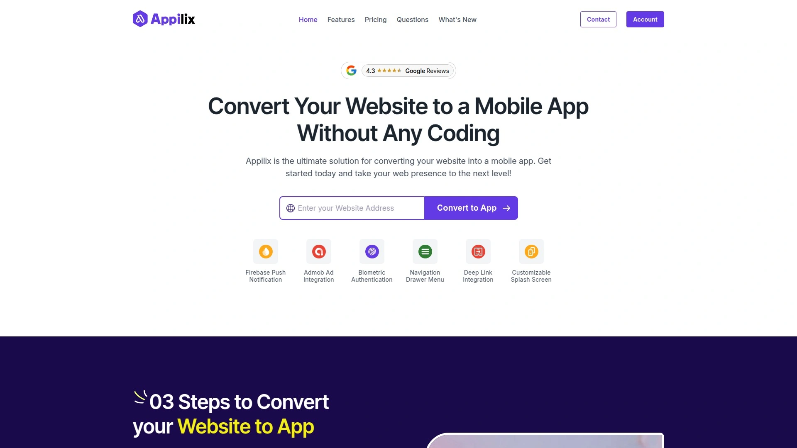

Appilix strips app creation down to essentials—paste your website URL, adjust a few options, and generate your Android app. The streamlined approach works well for content-driven websites and small service providers who want mobile presence without complexity. Setup takes minutes rather than hours, making it ideal when speed matters more than extensive customization.

AdMob integration allows monetization through in-app advertising if you want to generate revenue from your app. The platform supports both dynamic websites with changing content and static sites with fixed information. Basic customization options let you adjust app icons, splash screens, and color schemes to match your brand.

This tool targets freelancers, solopreneurs, and small businesses operating on tight budgets who primarily need Android apps. Appilix works best for straightforward website conversions where advanced native features aren't requirements.

***

## **[WebToApp.design](https://webtoapp.design)**

Convert any website into Android and iOS apps with straightforward configuration.

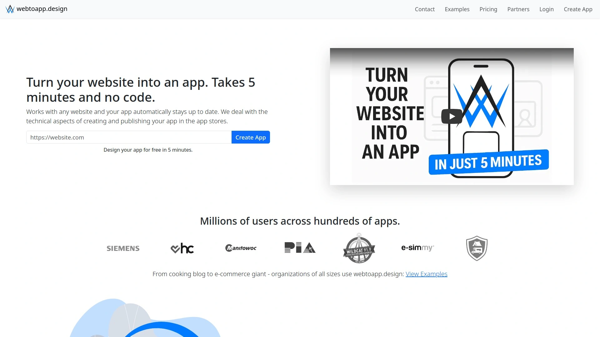

WebToApp.design has been converting websites to mobile apps since 2014, focusing on reliability and simplicity. The platform accepts any website URL and transforms it into native app packages for both major mobile operating systems. Configuration happens through a clean interface where you set app behavior, navigation patterns, and visual elements.

The service handles technical requirements for app store submissions, generating properly formatted APK and IPA files. Apps maintain consistent functionality across Android and iOS while respecting platform-specific design guidelines. WebToApp includes standard features like offline access, custom menus, and notification systems.

Users receive apps that automatically stay synchronized with website updates—changes to your site reflect in the app without rebuilding. The platform suits businesses with established websites seeking straightforward mobile expansion.

***

## **[AppPresser](https://apppresser.com)**

WordPress-focused builder emphasizing membership sites and learning management systems.

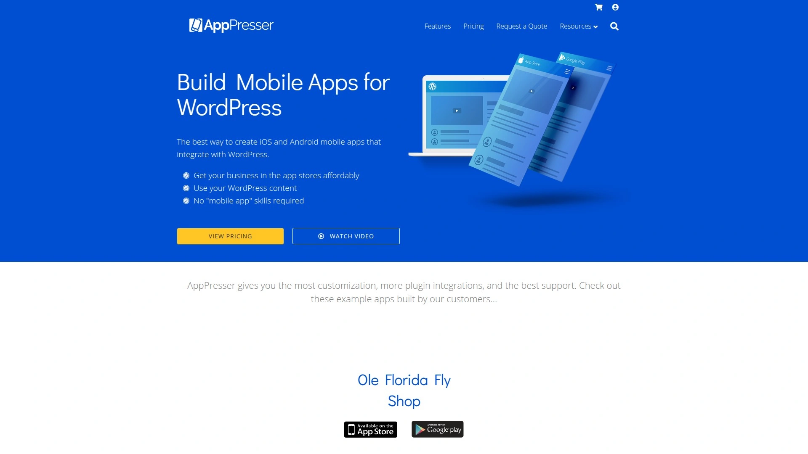

AppPresser specifically targets WordPress users running membership platforms, online courses, and LMS websites. The platform integrates deeply with popular WordPress plugins for memberships, subscriptions, and educational content delivery. You build your app directly within WordPress using familiar interfaces, then deploy to iOS and Android app stores.

Content automatically syncs between your WordPress site and mobile app in real-time. The builder works exceptionally well with membership plugins like MemberPress and learning management systems like LearnDash. Users can access course content, member forums, and restricted areas through native app interfaces.

AppPresser positions itself as the top choice for WordPress-based membership sites and educational platforms. The platform handles both community engagement apps and content delivery systems where users expect seamless mobile experiences.

---

## **[WPMobile.App](https://wordpress.com/plugins/mobile-app)**

Budget-friendly WordPress plugin offering lifetime licenses for iOS and Android apps.

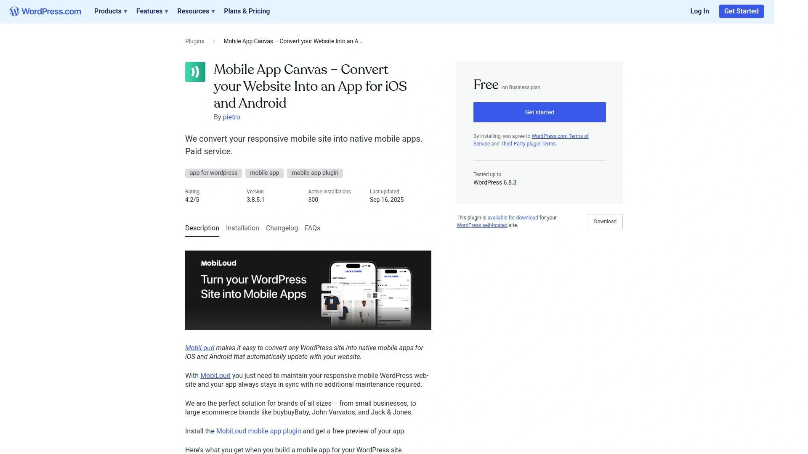

WPMobile.App stands out with lifetime pricing—pay once and own your app configuration forever without recurring subscription fees. The plugin installs directly in your WordPress dashboard, letting you configure and customize your mobile app without leaving your familiar WordPress environment. Both Android and iOS apps can be created independently or together.

Weglot integration enables multi-language app translations, expanding your reach to international audiences. Standard features include push notifications, offline content access, and unlimited app updates after purchase. Free app testing lets you verify everything works correctly before launching publicly.

A single-platform app (Android or iOS) costs 79€, while dual-platform support runs 149€—both as one-time payments. This lifetime licensing model eliminates ongoing costs, making WPMobile.App attractive for budget-conscious WordPress site owners who want predictable expenses.

***

## **[Adalo](https://www.adalo.com)**

Full no-code app builder creating real native mobile apps with responsive web functionality.

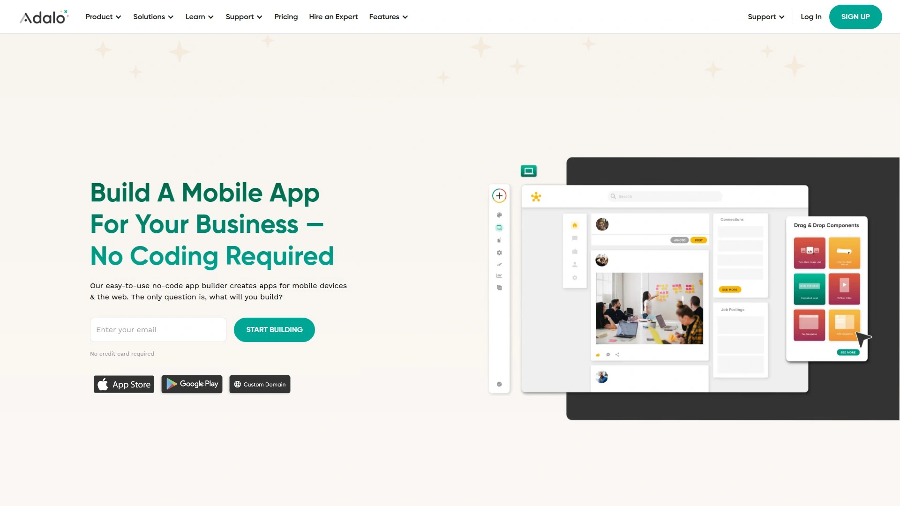

Adalo builds genuine native mobile apps, not web wrappers—meaning better performance and true app store presence. The platform balances design freedom with powerful functionality inside an interface accessible to non-technical users. Apps created in Adalo work as native mobile apps, responsive web apps, and progressive web apps simultaneously.

The plugin marketplace offers pre-built components like QR code readers, video players, and custom UI elements that drag directly into your app. Third-party integrations expand functionality further, with strong connections to backend builders like Xano for advanced data operations. Pricing starts at $36 monthly, with a permanent free tier letting you build and test indefinitely before publishing.

Adalo suits projects where app store presence is essential—the platform handles all technical requirements for Google Play and Apple App Store submissions. Entrepreneurs building marketplaces, social apps, or business tools choose Adalo when they need more than simple website conversions.

***

## **[Bubble](https://bubble.io)**

Powerful web app builder with unmatched functionality for complex workflows and SaaS platforms.

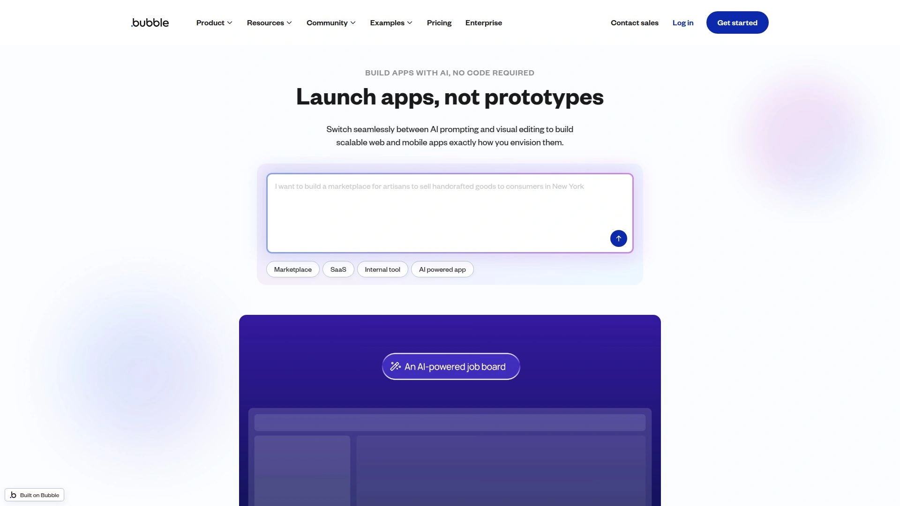

Bubble creates sophisticated web applications with functionality rivaling coded solutions. The platform has maintained backward compatibility for apps built over 12 years ago, demonstrating long-term stability. While primarily a web app builder, Bubble creates progressive web apps through third-party plugins.

The plugin marketplace contains pre-made functionality for virtually any use case imaginable—payment processing, user authentication, API integrations, and specialized workflows. The learning curve is steeper than simpler builders, but the payoff is near-unlimited customization without writing code. Bubble handles complicated business logic, multi-user systems, and database operations that simpler platforms can't support.

**Ideal for:** Entrepreneurs building SaaS products, marketplaces, or web apps with complex functionality who have patience for the learning process. The massive community provides tutorials, templates, and expert consultants for hire.

---

## **[Glide](https://www.glideapps.com)**

Mobile-first builder turning spreadsheets and databases into functional apps.

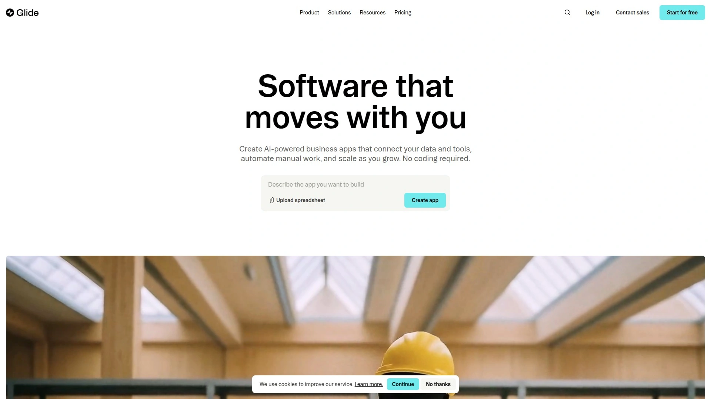

Glide transforms Google Sheets, Airtable, and other data sources into working mobile applications. The platform excels at creating apps from existing data structures—if your business logic already exists in spreadsheets, Glide converts it to app interfaces rapidly. AI-powered features help automate app generation based on your data schema.

The mobile-first approach prioritizes phone and tablet experiences over desktop web apps. Glide apps work as progressive web apps, providing app-like experiences without traditional app store distribution. The builder suits internal tools, client portals, and data-driven applications where information display matters more than complex workflows.

Teams already managing data in spreadsheets find Glide particularly efficient—no data migration required, just connect and build. The platform works well for lightweight portals, field service apps, and inventory management systems.

***

## **[Jotform Apps](https://www.jotform.com/products/apps/)**

Form-focused app builder for data collection and workflow automation.

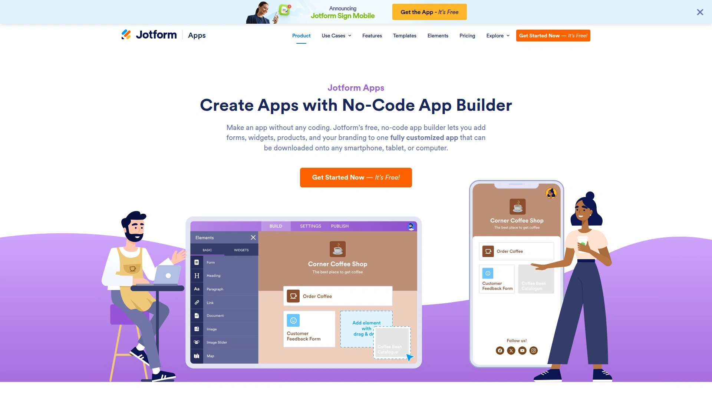

Jotform Apps extends the popular form builder into full mobile applications. The platform specializes in apps that collect information, process submissions, and manage form-based workflows. If your business relies on surveys, registrations, inspections, or data gathering, Jotform converts these processes into mobile apps.

Forms integrate seamlessly with the app builder, allowing you to create multi-screen applications around data collection needs. The no-code interface lets non-technical teams build functional business apps for field work, customer intake, or internal processes. Apps deploy across devices and integrate with existing Jotform workflows and automation systems.

Organizations using Jotform for forms naturally extend to Jotform Apps when mobile data collection becomes necessary. The platform works exceptionally well for businesses where forms and data entry drive core operations.

---

## **[Thunkable](https://thunkable.com)**

Drag-and-drop builder for Android and iOS apps with offline functionality.

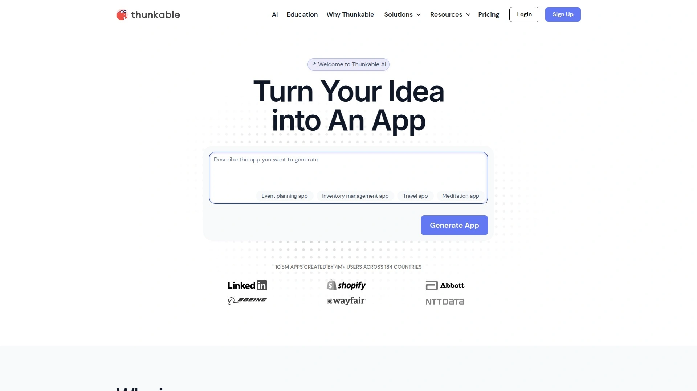

Thunkable provides a visual development environment for creating mobile apps with offline capabilities. The platform's drag-and-drop interface lets you build app logic without programming knowledge while offering more control than simple website converters. Apps function fully even without internet connectivity, storing data locally and syncing when connections restore.

A robust community provides support, tutorials, and shared components. Multiple publishing options make deployment and distribution straightforward across both major app stores. The platform includes monetization features in higher-tier plans, enabling in-app purchases and advertising integration.

**Learning curve consideration:** Thunkable requires more time investment than simpler builders but delivers greater flexibility. The platform suits users comfortable with logical thinking who want mobile apps with custom functionality beyond basic website wrappers.

***

## **[AppsGeyser](https://appsgeyser.com)**

Free Android app creator with 70+ templates for experimentation and testing.

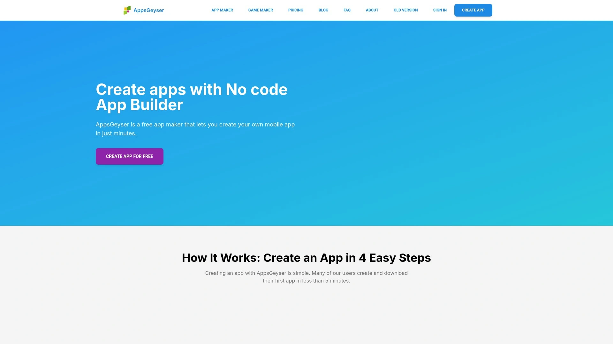

AppsGeyser has operated since the early days of Android apps, offering completely free app creation. The platform provides over 70 templates including website converters, content apps, and simple tools. Users can create Android apps without any upfront investment, making it perfect for testing ideas before committing resources.

The service focuses exclusively on Android, avoiding iOS complexity. Ad monetization options let creators generate revenue through their apps. Quick deployment means you can have an app published on Google Play within hours of starting.

This platform suits hobbyists, students, and entrepreneurs wanting to validate app concepts without financial risk. AppsGeyser works well for test projects, simple utility apps, or initial market testing before investing in premium platforms.

---

## FAQ

**What's the fastest way to convert my WordPress site into a mobile app?**

AppMySite and WPMobile.App both integrate directly with WordPress dashboards and can generate preview apps within minutes. Connect your site using their free plugins, customize basic settings like colors and menus, then test on emulators immediately. For managed service where experts handle everything, MobiLoud builds and submits your app while you focus on content.

**Do I need coding skills to use these no-code app builders?**

None of these platforms require programming knowledge. AppMySite, Appy Pie, and Appilix offer the simplest interfaces for complete beginners. Bubble and Thunkable have steeper learning curves but still operate without code—you'll just need more time to master their visual interfaces.

**Can these apps be published to both Apple App Store and Google Play Store?**

Most platforms generate apps for both iOS and Android—AppMySite, Natively, BuildFire, and MobiLoud all support dual-platform publishing. AppsGeyser and Appilix focus exclusively on Android. Each builder provides either direct publishing assistance or downloadable APK and IPA files you submit yourself.

---

## Conclusion

Choosing the right no-code mobile app builder depends on your specific needs—whether you're converting an existing WordPress site, building a custom app from scratch, or need managed services with expert support. Most platforms offer free trials or preview plans, letting you test functionality before committing financially.

For WordPress and WooCommerce users specifically, **[AppMySite](https://www.appmysite.com)** delivers the best balance of real-time synchronization, customization options, and preview capabilities at accessible price points. The platform's connectivity troubleshooting and unlimited testing in the free tier make it ideal for bloggers, online store owners, and digital publishers who want mobile apps that automatically stay updated with their websites.
